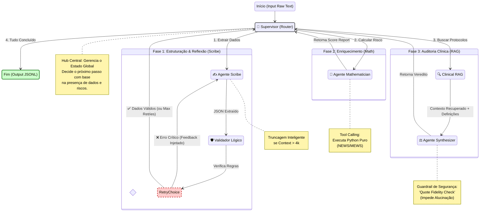

# TriaLogic 🏥🤖

**TriaLogic** is an advanced **Agentic Workflow System** designed for automated clinical data analysis. It leverages a multi-agent architecture to extract structured information from unstructured medical records (e.g., discharge summaries), validate the data, calculate clinical risk scores, and perform audits against gold-standard medical guidelines using Retrieval-Augmented Generation (RAG).

## 🚀 Key Features

*   **Multi-Agent Orchestration**: Powered by **LangGraph**, utilizing a Supervisor agent to manage state and route tasks efficiently.
*   **Clinical Extraction (Scribe)**: Transforms unstructured clinical text into structured data formats.
*   **Self-Correction (Validator)**: Validates extracted data and loops back to the Scribe agent for corrections if errors are detected.
*   **Risk Analysis (Mathematician)**: Performs deterministic calculations (e.g., LACE index, Readmission Risk) based on validated clinical parameters.
*   **Evidence-Based Auditing (Clinical RAG)**: Retrieves relevant clinical guidelines from a ChromaDB vector store to audit cases and provide recommendations.
*   **Batch Processing**: Capable of processing large datasets of clinical records efficiently.

## 🏗️ Architecture

The system follows a directed graph workflow managed by a Supervisor node:

1.  **Input**: Clinical text (Admission/Discharge notes).
2.  **Supervisor**: Determines the next step based on the current state.
3.  **Scribe Agent**: Extracts key entities (diagnoses, procedures, length of stay, acuity).
4.  **Validator Node**: Checks for data integrity and consistency.
5.  **Mathematician Agent**: Computes risk scores.
6.  **Clinical RAG (Auditor) Agent**: Retrieves similar "Gold Standard" cases and guidelines to synthesize a final audit report.
7.  **Synthesizer**: Compiles the final output.



## 📂 Project Structure

```text
TriaLogic/
├── chroma_db/          # Vector database (ChromaDB) for RAG
├── data/               # Input datasets (CSV) and gold standards
├── docs/               # Documentation and definitions
├── prompts/            # System prompts for each agent (Scribe, Auditor, etc.)
├── results/            # Output files and experiment logs
├── scripts/            # Value-add scripts (ingestion, batch processing)
├── src/
│   ├── agents/         # Implementation of agent nodes (Scribe, Math, RAG, etc.)
│   ├── dataset/        # Data loading utilities
│   ├── retriever_data/ # RAG preprocessing and embedding logic
│   ├── schemas/        # Pydantic models for structured output
│   ├── state/          # LangGraph state definitions
│   ├── tools/          # Helper tools (calculator, etc.)
│   └── main.py         # Graph definition
└── requirements.txt    # Project dependencies
```

## 🛠️ Installation

1.  **Clone the repository**:
    ```bash
    git clone https://github.com/yourusername/TriaLogic.git
    cd TriaLogic
    ```

2.  **Create a virtual environment**:
    ```bash
    python -m venv venv
    source venv/bin/activate  # On Windows: venv\Scripts\activate
    ```

3.  **Install dependencies**:
    ```bash
    pip install -r requirements.txt
    ```

4.  **Environment Setup**:
    Ensure you have your LLM API keys configured (e.g., `OPENAI_API_KEY`, `ANTHROPIC_API_KEY`) in a `.env` file.

## 🏃 Usage

### 1. Ingest Knowledge Base (for RAG)
Before running the agents, ingest your gold standard documents into the vector database:
```bash
python scripts/ingest_knowledge.py
```

### 2. Run Single Case Analysis
To test the workflow on a specific case:
```bash
python scripts/run_single.py
```

### 3. Run Batch Processing
To process a dataset (e.g., `discharge.csv`):
```bash
python scripts/run_batch_processing.py
```

## 🧠 Model & Agents

*   **Scribe**: Expert in clinical entity extraction.
*   **Mathematician**: Handles numerical scoring logic.
*   **Auditor**: Uses RAG to align findings with clinical protocols.
*   **Validator**: Ensures output schema conformance.

## 📄 License

[MIT License](LICENSE)
