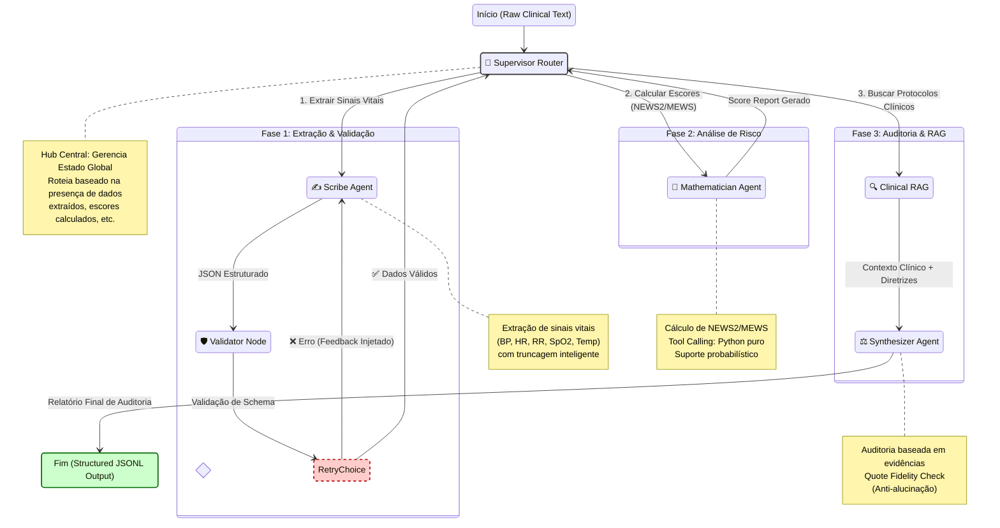

# TriaLogic 🏥🤖

**TriaLogic** é um **Sistema de Workflow com Agentes** avançado projetado para análise automatizada de dados clínicos. Utiliza uma arquitetura multi-agente para extrair informações estruturadas de registros médicos não estruturados (ex: sumários de alta), validar os dados, calcular escores de risco clínico, e realizar auditorias contra diretrizes médicas padrão-ouro usando Retrieval-Augmented Generation (RAG).

## 🚀 Características Principais

*   **Orquestração Multi-Agente**: Powered by **LangGraph**, utilizando um agente Supervisor para gerenciar estado e rotear tarefas eficientemente.
*   **Extração Clínica (Scribe)**: Transforma texto clínico não estruturado em formatos de dados estruturados com foco em sinais vitais e parâmetros fisiológicos.
*   **Auto-Correção (Validator)**: Valida dados extraídos e retorna ao agente Scribe para correções se erros forem detectados.
*   **Análise de Risco (Mathematician)**: Realiza cálculos determinísticos de escores clínicos (NEWS2, MEWS, qSOFA) baseados em parâmetros clínicos validados.
*   **Auditoria Baseada em Evidências (Clinical RAG)**: Recupera diretrizes clínicas relevantes de um banco vetorial ChromaDB para auditar casos e fornecer recomendações baseadas em protocolos estabelecidos.
*   **Processamento em Lote**: Capaz de processar grandes conjuntos de dados de registros clínicos de forma eficiente com medição de latência.

## 🏗️ Arquitetura

O sistema segue um workflow de grafo dirigido gerenciado por um nó Supervisor:

1.  **Input**: Texto clínico (notas de internação/alta hospitalar).
2.  **Supervisor**: Determina o próximo passo baseado no estado atual do processamento.
3.  **Scribe Agent**: Extrai entidades-chave (sinais vitais: pressão arterial, frequência cardíaca, frequência respiratória, saturação de oxigênio, temperatura).
4.  **Validator Node**: Verifica integridade e consistência dos dados com loop de retry automático.
5.  **Mathematician Agent**: Computa escores de risco clínico (NEWS2, MEWS) usando cálculos determinísticos e probabilísticos.
6.  **Clinical RAG (Auditor) Agent**: Recupera casos "Padrão-Ouro" similares e diretrizes clínicas (Sepsis-3, qSOFA, SIRS) para sintetizar um relatório de auditoria final.
7.  **Synthesizer**: Compila a saída final com base no contexto recuperado e validações de segurança.



## 📂 Estrutura do Projeto

```text
TriaLogic/
├── chroma_db/              # Banco de dados vetorial (ChromaDB) para RAG
├── data/                   # Datasets de entrada e padrões-ouro
│   ├── discharge.csv       # Dados originais de alta hospitalar  
│   ├── gold_standard_dataset.csv  # Dataset validado para avaliação
│   └── master_dataset.csv  # Dataset principal consolidado
├── docs/                   # Documentação técnica
│   └── definitions.txt     # Definições clínicas (NEWS2, MEWS, Sepsis-3)
├── prompts/                # Prompts de sistema para cada agente
│   ├── scribe_prompt.md    # Prompt para extração de sinais vitais
│   ├── auditor_prompt.md   # Prompt para auditoria clínica
│   └── mathematician_prompt.md  # Prompt para cálculos de risco
├── results/                # Arquivos de saída e logs de experimentos
│   ├── *_experiment_results_v*.jsonl  # Resultados experimentais
│   ├── tcc_final_metrics.csv  # Métricas finais de avaliação
│   └── per_system/         # Relatórios por sistema avaliado
├── scripts/                # Scripts utilitários
│   ├── run_batch_processing.py  # Processamento em lote principal
│   ├── run_baseline.py     # Execução de baseline zero-shot
│   ├── evaluation.py       # Sistema de avaliação e métricas
│   └── ingest_knowledge.py # Ingestão de conhecimento para RAG
├── src/                    # Código-fonte principal
│   ├── agents/             # Implementação dos nós agente
│   │   ├── scribe.py       # Agente de extração clínica
│   │   ├── validator.py    # Nó de validação com retry loop
│   │   ├── mathematician.py # Agente de cálculo de escores
│   │   ├── clinical_rag.py # Agente RAG para auditoria
│   │   └── supervisor.py   # Roteador/supervisor do workflow
│   ├── schemas/            # Modelos Pydantic para saída estruturada
│   ├── state/              # Definições de estado do LangGraph
│   ├── tools/              # Ferramentas auxiliares (calculadora)
│   └── main.py             # Definição e compilação do grafo
└── requirements.txt        # Dependências do projeto
```

## 🛠️ Instalação

1. **Clone o repositório**:

    ```bash
    git clone https://github.com/yourusername/TriaLogic.git
    cd TriaLogic
    ```

2. **Configure o ambiente Python** (recomenda-se Conda):

    ```bash
    # Opção 1: Usando Conda
    conda create -n trialogic python=3.10
    conda activate trialogic

    # Opção 2: Usando venv
    python -m venv venv
    source venv/bin/activate  # No Windows: venv\Scripts\activate
    ```

3. **Instale as dependências**:

    ```bash
    pip install -r requirements.txt
    ```

4. **Configuração do Ambiente**:

    Crie um arquivo `.env` na raiz do projeto (opcional, para configurações extras):

    ```env
    ANTHROPIC_API_KEY=sua_chave_anthropic_aqui  # Opcional
    ```

    **Pré-requisito**: Instale o [Ollama](https://ollama.ai) e baixe o modelo:

    ```bash
    ollama pull llama3.1:8b
    ```

5. **Prepare a Base de Conhecimento** (para RAG):

    ```bash
    python scripts/ingest_knowledge.py
    ```

## 🏃 Uso

### 1. Configurar Base de Conhecimento (RAG)

Antes de executar os agentes, ingira os documentos padrão-ouro no banco vetorial:

```bash
python scripts/ingest_knowledge.py
```

### 2. Executar Análise de Caso Único

Para testar o workflow em um caso específico:

```bash
python scripts/run_single.py
```

### 3. Processamento em Lote

Para processar um dataset completo (e.g., `gold_standard_dataset.csv`):

```bash
python scripts/run_batch_processing.py
```

### 4. Executar Baseline para Comparação

Para executar o baseline zero-shot:

```bash
python scripts/run_baseline.py
```

### 5. Avaliação e Métricas

Para avaliar resultados experimentais:

```bash
python scripts/evaluation.py
```

## 📊 Resultados e Métricas

O sistema reporta automaticamente métricas detalhadas incluindo:

- **Precisão de Extração**: Acurácia na extração de sinais vitais (Pressão Sistólica, FC, FR, SpO₂, Temperatura)
- **Erro Absoluto Médio (MAE)**: Para valores numéricos extraídos
- **Acurácia de Escores**: NEWS2 e MEWS calculados vs. padrão-ouro
- **Taxa de Alucinação**: Frequência de informações não presentes no texto original
- **Latência por Agente**: Tempo de processamento detalhado

### Exemplo de Métricas de Performance

| Sistema | Rec_SBP | MAE_SBP | Acc_MEWS | Acc_NEWS | Taxa_Alucinação |
|---------|---------|---------|----------|----------|-----------------|
| Baseline (Zero-Shot) | 94.1% | 5.76 | 3.6% | 22.9% | 34.3% |
| TriaLogic (Completo) | 94.1% | 4.0 | 23.2% | 19.5% | 47.1% |

## 🧠 Agentes e Modelos

- **Scribe Agent**: Especializado na extração de sinais vitais de texto clínico não estruturado. Utiliza um processo de dois passos para identificar candidatos e extrair valores precisos.
- **Validator Node**: Garante conformidade com schema Pydantic e realiza validação lógica com sistema de retry automático.
- **Mathematician Agent**: Calcula escores de risco clínico (NEWS2, MEWS) usando tool calling para execução Python determinística e probabilística.
- **Clinical RAG Agent**: Recupera diretrizes clínicas (Sepsis-3, qSOFA, SIRS) do banco vetorial ChromaDB para auditoria baseada em evidências.
- **Synthesizer Agent**: Compila relatório final com verificação de fidelidade de citações (anti-alucinação).

### Tecnologias Principais

- **LangGraph**: Framework de orquestração de agentes
- **LLaMA 3.1 8B (via Ollama)**: Modelo de linguagem principal (local)
- **HuggingFace Sentence-Transformers**: Embeddings para RAG (all-MiniLM-L6-v2)
- **ChromaDB**: Banco de dados vetorial para RAG
- **Pydantic**: Validação e estruturação de dados
- **LangChain**: Ferramentas de LLM e integração

## 🚀 Considerações de Produção

### Performance e Latência

- **Latência Média**: 30-60s por caso em hardware típico
- **Aumento vs. Baseline**: 3–5× comparado ao zero-shot (devido à orquestração multi-agente)
- **Agentes Dominantes**: Scribe e Mathematician tipicamente dominam o tempo de execução
- **Monitoramento**: Tempo por agente é automaticamente registrado e reportado

### Viabilidade Clínica

- **Triagem Automatizada**: Latência aceitável para uso em pronto-socorro (dentro do tempo padrão de espera)
- **Análise de Risco**: Adequado para sistemas de alerta precoce e priorização de pacientes
- **Auditoria Retrospectiva**: Ideal para análise em lote de casos históricos

### Otimizações Recomendadas

- **Paralelismo**: Execução paralela de agentes independentes
- **Early Stopping**: Encerramento ao atingir confiança suficiente
- **Caching**: Cache de respostas LLM e resultados intermediários
- **Load Balancing**: Distribuição de carga para processamento em larga escala

## ⚠️ Limitações e Considerações

- **Dependência de LLM**: Performance sujeita à disponibilidade e latência de APIs externas
- **Contexto Limitado**: Truncagem automática para contextos > 4k tokens
- **Domínio Específico**: Otimizado para sinais vitais e escores NEWS2/MEWS
- **Validação Clínica**: Requer validação adicional para uso em produção hospitalar

## 🤝 Contribuindo

Contribuições são bem-vindas! Por favor:

1. Faça um fork do projeto
2. Crie uma branch para sua feature (`git checkout -b feature/nova-feature`)
3. Commit suas mudanças (`git commit -am 'Adiciona nova feature'`)
4. Push para a branch (`git push origin feature/nova-feature`)
5. Abra um Pull Request

## 📚 Referências Clínicas

- **NEWS2**: National Early Warning Score 2 (Royal College of Physicians)
- **MEWS**: Modified Early Warning Score
- **Sepsis-3**: Third International Consensus Definitions for Sepsis
- **qSOFA**: Quick Sequential Organ Failure Assessment

## 📄 Licença

[MIT License](LICENSE.md)

---

**Aviso**: Este sistema é destinado apenas para fins de pesquisa e educação. Não deve ser usado para tomada de decisões clínicas sem validação e supervisão médica adequadas.
