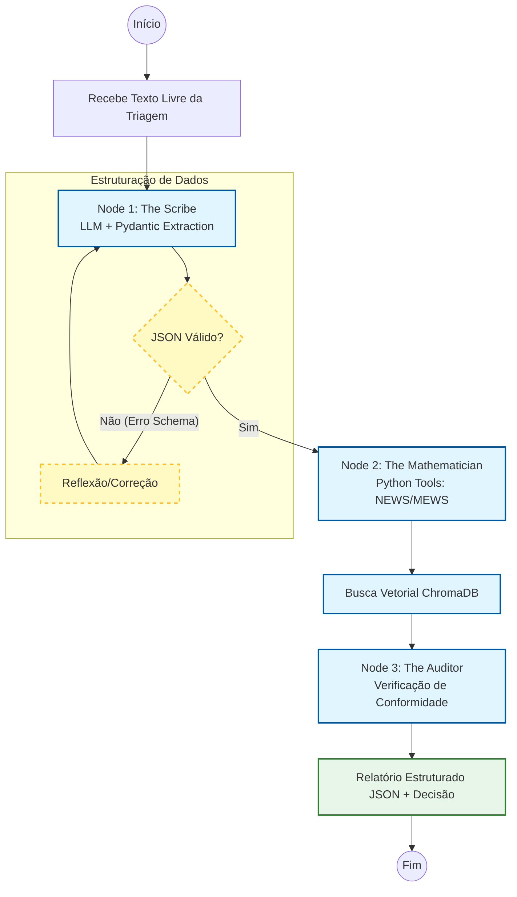

```mermaid
---
config:
  theme: default
  mermaid:
    securityLevel: loose
    flowchart:
      useMaxWidth: false
      htmlLabels: true
---
graph TD
    classDef agent fill:#e1f5fe,stroke:#01579b,stroke-width:2px;
    classDef guardrail fill:#fff9c4,stroke:#fbc02d,stroke-width:2px,stroke-dasharray: 5 5;
    classDef endNode fill:#e8f5e9,stroke:#2e7d32,stroke-width:2px;
    Start((Início)) --> Input[Recebe Texto Livre da Triagem]
    Input --> Scribe
    subgraph "Estruturação de Dados"
        Scribe[Node 1: The Scribe<br/>LLM + Pydantic Extraction]:::agent
        Scribe --> CheckValid{JSON Válido?}:::guardrail
        
        CheckValid -- Não (Erro Schema) --> Fix[Reflexão/Correção]:::guardrail
        Fix --> Scribe
    end
    CheckValid -- Sim --> Mathematician[Node 2: The Mathematician<br/>Python Tools: NEWS/MEWS]:::agent
    Mathematician --> Retrieve[Busca Vetorial ChromaDB]:::agent
    Retrieve --> Auditor[Node 3: The Auditor<br/>Verificação de Conformidade]:::agent
    Auditor --> FinalOutput[Relatório Estruturado JSON + Decisão]:::endNode
    FinalOutput --> End((Fim))
    click Scribe "Referência: [cite: 35]"
    click Mathematician "Referência: [cite: 39]"
    click Auditor "Referência: [cite: 44]"
```