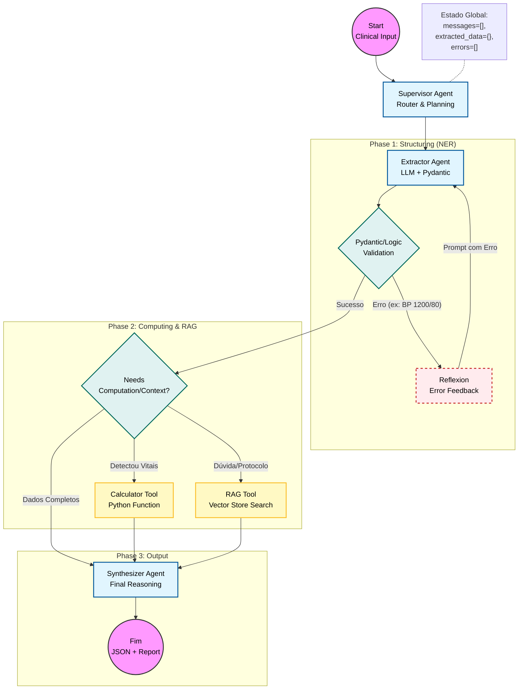

```mermaid
graph TD
    %% Estilos
    classDef startend fill:#f9f,stroke:#333,stroke-width:2px,color:black;
    classDef agent fill:#e1f5fe,stroke:#01579b,stroke-width:2px,color:black;
    classDef tool fill:#fff9c4,stroke:#fbc02d,stroke-width:2px,color:black;
    classDef guardrail fill:#ffebee,stroke:#c62828,stroke-width:2px,stroke-dasharray: 5 5,color:black;
    classDef decision fill:#e0f2f1,stroke:#00695c,stroke-width:2px,shape:rhombus,color:black;

    %% Nós Principais
    Start((Start<br>Clinical Input)):::startend
    Supervisor[Supervisor Agent<br>Router & Planning]:::agent
    
    %% Subgrafo de Extração
    subgraph "Phase 1: Structuring (NER)"
        Extractor[Extractor Agent<br>LLM + Pydantic]:::agent
        Validator{Pydantic/Logic<br>Validation}:::decision
        Retry[Reflexion<br>Error Feedback]:::guardrail
    end

    %% Subgrafo de Ferramentas
    subgraph "Phase 2: Computing & RAG"
        ToolRouter{Needs<br>Computation/Context?}:::decision
        Calculator[Calculator Tool<br>Python Function]:::tool
        RAG[RAG Tool<br>Vector Store Search]:::tool
    end
    
    %% Subgrafo de Síntese
    subgraph "Phase 3: Output"
        Synthesizer[Synthesizer Agent<br>Final Reasoning]:::agent
        End((Fim<br>JSON + Report)):::startend
    end

    %% Conexões
    Start --> Supervisor
    Supervisor --> Extractor
    
    Extractor --> Validator
    
    %% Lógica de Validação (O "Guardrail")
    Validator -- "Erro (ex: BP 1200/80)" --> Retry
    Retry -- "Prompt com Erro" --> Extractor
    Validator -- "Sucesso" --> ToolRouter
    
    %% Lógica de Ferramentas
    ToolRouter -- "Detectou Vitais" --> Calculator
    ToolRouter -- "Dúvida/Protocolo" --> RAG
    ToolRouter -- "Dados Completos" --> Synthesizer
    
    Calculator --> Synthesizer
    RAG --> Synthesizer
    
    Synthesizer --> End

    %% Notas de Tech Lead
    note1["Estado Global: <br>messages=[], <br>extracted_data={}, <br>errors=[]"]
    note1 -.- Supervisor
```