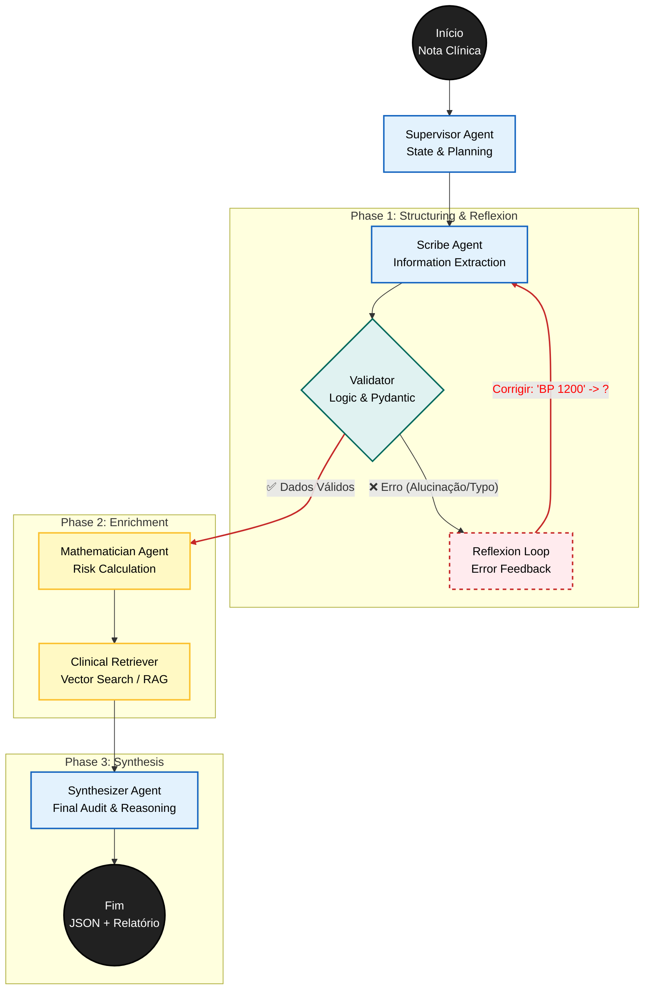

```mermaid
graph TD
    %% --- ESTILOS ---
    classDef startend fill:#212121,stroke:#000,stroke-width:2px,color:#fff;
    classDef agent fill:#e3f2fd,stroke:#1565c0,stroke-width:2px,color:#000;
    classDef function fill:#fff9c4,stroke:#fbc02d,stroke-width:2px,color:#000;
    classDef guardrail fill:#ffebee,stroke:#c62828,stroke-width:2px,stroke-dasharray: 5 5,color:#000;
    classDef router fill:#e0f2f1,stroke:#00695c,stroke-width:2px,shape:rhombus,color:#000;

    %% --- NÓS ---
    Start((Início<br>Nota Clínica)):::startend
    
    %% O Cérebro
    Supervisor[Supervisor Agent<br>State & Planning]:::agent

    %% FASE 1: ESTRUTURAÇÃO & REFLEXÃO
    subgraph "Phase 1: Structuring & Reflexion"
        direction TB
        Scribe[Scribe Agent<br>Information Extraction]:::agent
        Validator{Validator<br>Logic & Pydantic}:::router
        Retry[Reflexion Loop<br>Error Feedback]:::guardrail
    end

    %% FASE 2: ENRIQUECIMENTO (FERRAMENTAS)
    subgraph "Phase 2: Enrichment"
        direction TB
        Mathematician[Mathematician Agent<br>Risk Calculation]:::function
        ClinicalRAG[Clinical Retriever<br>Vector Search / RAG]:::function
    end

    %% FASE 3: SÍNTESE FINAL
    subgraph "Phase 3: Synthesis"
        Synthesizer[Synthesizer Agent<br>Final Audit & Reasoning]:::agent
        Output((Fim<br>JSON + Relatório)):::startend
    end

    %% --- CONEXÕES ---
    Start --> Supervisor
    Supervisor --> Scribe
    
    %% O Ciclo de Auto-Correção (O "Pulo do Gato" Acadêmico)
    Scribe --> Validator
    Validator -- "❌ Erro (Alucinação/Typo)" --> Retry
    Retry -- "Corrigir: 'BP 1200' -> ?" --> Scribe
    
    %% Fluxo de Sucesso
    Validator -- "✅ Dados Válidos" --> Mathematician
    Mathematician --> ClinicalRAG
    ClinicalRAG --> Synthesizer
    
    Synthesizer --> Output

    %% --- ANOTAÇÕES TÉCNICAS ---
    linkStyle 4 stroke:#c62828,stroke-width:2px,color:red;
    linkStyle 5 stroke:#c62828,stroke-width:2px;
```