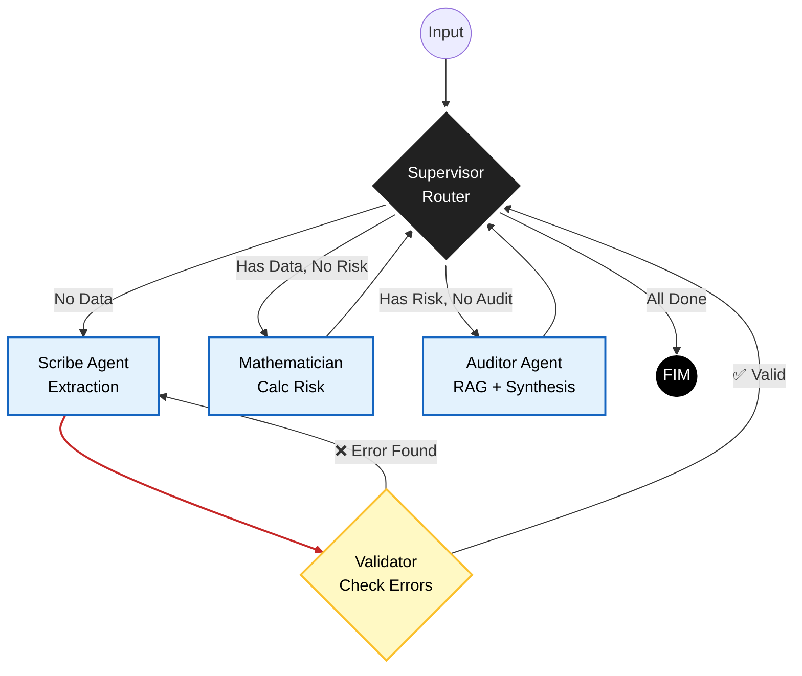

```mermaid
graph TD
    %% Estilos
    classDef hub fill:#212121,stroke:#fff,stroke-width:4px,color:#fff;
    classDef agent fill:#e3f2fd,stroke:#1565c0,stroke-width:2px,color:#000;
    classDef check fill:#fff9c4,stroke:#fbc02d,stroke-width:2px,color:#000;
    classDef endnode fill:#000,stroke:#fff,color:#fff;

    Start((Input)) --> Supervisor

    %% O Hub Central
    Supervisor{Supervisor<br>Router}:::hub

    %% Os Agentes
    Scribe[Scribe Agent<br>Extraction]:::agent
    Validator{Validator<br>Check Errors}:::check
    Mathematician[Mathematician<br>Calc Risk]:::agent
    Auditor[Auditor Agent<br>RAG + Synthesis]:::agent
    
    %% O Fluxo Controlado pelo Supervisor
    Supervisor -- "No Data" --> Scribe
    Supervisor -- "Has Data, No Risk" --> Mathematician
    Supervisor -- "Has Risk, No Audit" --> Auditor
    Supervisor -- "All Done" --> End((FIM)):::endnode

    %% O Loop de Validação (A única aresta que foge do Supervisor)
    Scribe --> Validator
    Validator -- "❌ Error Found" --> Scribe
    Validator -- "✅ Valid" --> Supervisor

    %% Retornos ao Hub
    Mathematician --> Supervisor
    Auditor --> Supervisor

    %% Links de Estilo
    linkStyle 5 stroke:#c62828,stroke-width:2px;
```