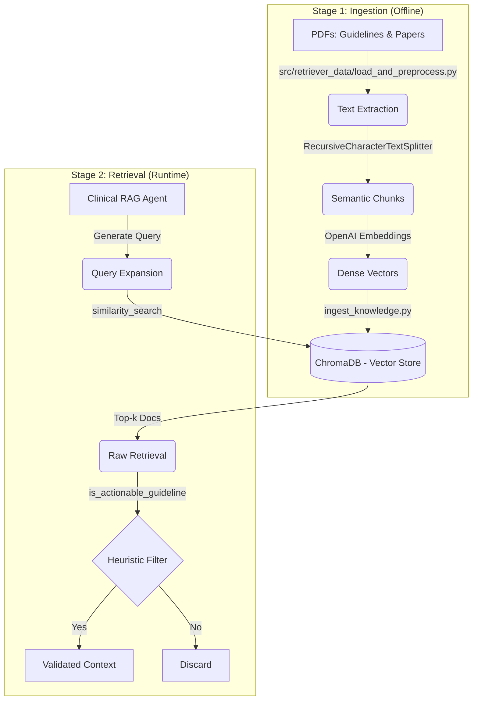

```mermaid
graph TD
    subgraph "Stage 1: Ingestion (Offline)"
        A[PDFs: Guidelines & Papers] -->|src/retriever_data/load_and_preprocess.py| B(Text Extraction)
        B -->|RecursiveCharacterTextSplitter| C(Semantic Chunks)
        C -->|OpenAI Embeddings| D(Dense Vectors)
        D -->|ingest_knowledge.py| E[(ChromaDB - Vector Store)]
    end

    subgraph "Stage 2: Retrieval (Runtime)"
        F[Clinical RAG Agent] -->|Generate Query| G(Query Expansion)
        G -->|similarity_search| E
        E -->|Top-k Docs| H(Raw Retrieval)
        H -->|is_actionable_guideline| I{Heuristic Filter}
        I -- Yes --> J[Validated Context]
        I -- No --> K[Discard]
    end
```